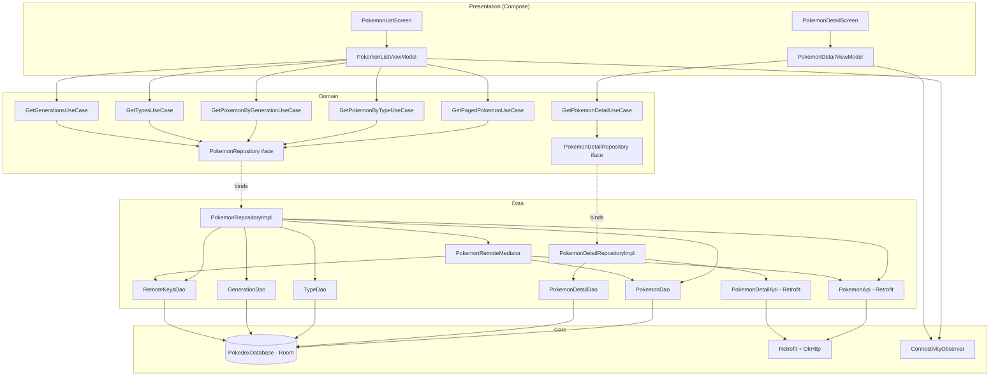
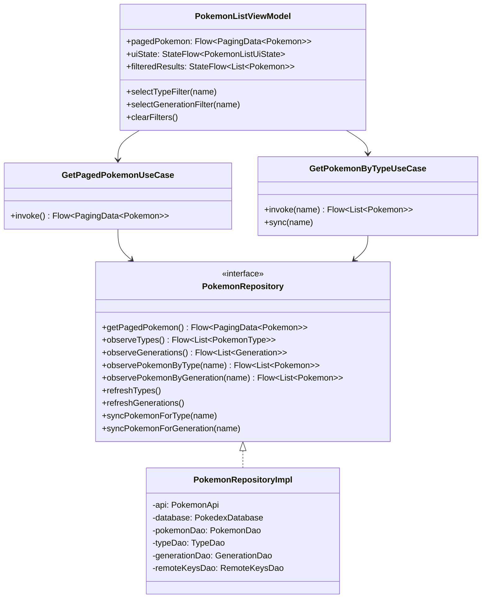

# 01 - Arquitectura

La aplicacion esta organizada en **capas limpias** (Clean Architecture) con **organizacion vertical por feature**. La regla principal: las dependencias apuntan **hacia adentro** (UI -> ViewModel -> UseCase -> Repository interface), nunca al reves.

## Capas

| Capa | Responsabilidad | Conoce a... | Usa... |
|---|---|---|---|
| **Presentation** | Composables y ViewModels | Domain | Compose, StateFlow, Hilt |
| **Domain** | Use cases y modelos puros | Solo a si misma | Coroutines |
| **Data** | Implementaciones de repositorio, API, DAOs, mappers | Domain | Retrofit, Room, Paging 3 |
| **Core** | Infraestructura compartida | - | Hilt, OkHttp, ConnectivityManager |
| **Shared** | UI reutilizable y theme | Domain (solo modelos) | Compose |

## Diagrama de componentes

## Diagrama de clases (feature pokemonlist)

## Single Source of Truth

La UI **siempre** observa Room. Cuando llega un dato nuevo:

1. Se hace la llamada HTTP via Retrofit.
2. El DTO se mapea a Entity.
3. Se inserta en Room (upsert).
4. Room emite el cambio via Flow.
5. El ViewModel recibe el nuevo valor y la UI se recompone.

Esto garantiza que **offline funcione gratis**: si la API falla, Room sigue emitiendo el ultimo estado conocido.

## Inyeccion de dependencias

Hilt conecta todo:

- `core/network/di/NetworkModule` - Retrofit, OkHttp, Moshi, ConnectivityObserver (singletons).
- `core/database/di/DatabaseModule` - Room database y todos los DAOs.
- `feature/<x>/di/<X>Module` - API especifica del feature y `@Binds` del repositorio (interfaz -> implementacion).

Los ViewModels se obtienen con `hiltViewModel()` en los Composables.
