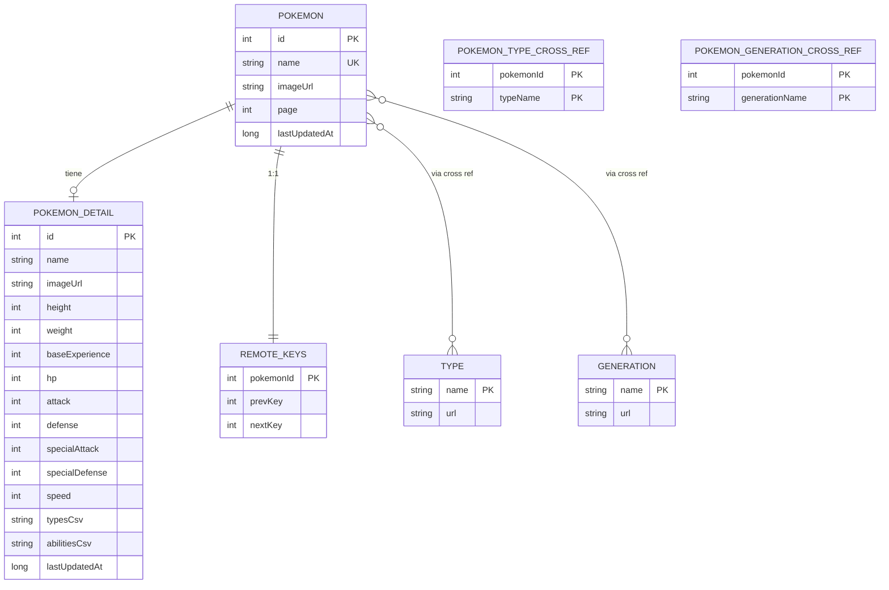

# 03 - Base de datos (Room / SQLite)

## Por que SQLite (via Room)

La actividad pide explicitamente **SQLite**. Room es la libreria oficial de Android para trabajar con SQLite y se eligio por:

- **Verifica las queries en tiempo de compilacion**: si una `@Query` esta mal escrita, no compila.
- **Soporte nativo de Flow** y `PagingSource`: integracion directa con Compose y Paging 3.
- **Soporte de relaciones** (cross refs): permite modelar muchos-a-muchos entre Pokemon y tipos/generaciones sin SQL crudo.
- **Migraciones tipadas**: si el esquema evoluciona, se versiona explicitamente.
- **Genera la implementacion via KSP**, sin reflexion en runtime.

Alternativas descartadas:
- **DataStore** - solo guarda preferencias clave/valor, no soporta queries relacionales.
- **Archivos JSON** - sin queries, sin transacciones, sin observabilidad.
- **SQLite raw** - sin verificacion de tipos, codigo verboso.

## Esquema (resumen)

7 tablas:

1. `pokemon` - lista basica cacheada por pagina.
2. `pokemon_detail` - ficha tecnica completa.
3. `type` - catalogo de tipos.
4. `generation` - catalogo de generaciones.
5. `pokemon_type_cross_ref` - muchos-a-muchos pokemon <-> tipo.
6. `pokemon_generation_cross_ref` - muchos-a-muchos pokemon <-> generacion.
7. `remote_keys` - claves prev/next del RemoteMediator de Paging 3.

## Diagrama ER (Mermaid)



## Detalle de cada tabla

### `pokemon`
Lista basica que alimenta el grid principal. Cada fila representa un Pokemon individual con la info minima necesaria para renderizar la card.

| Columna | Tipo | Notas |
|---|---|---|
| id | INTEGER | PK. Es el id nacional (1..1302). |
| name | TEXT | Nombre lower-case (`pikachu`). |
| imageUrl | TEXT | URL del official artwork. |
| page | INTEGER | Pagina del Paging 3 a la que pertenece. Usado para invalidaciones futuras. |
| lastUpdatedAt | INTEGER | Epoch ms. Para freshness. |

### `pokemon_detail`
Ficha tecnica obtenida del endpoint `/pokemon/{id}`. Tiene su propia tabla porque tiene muchas mas columnas y solo se carga cuando el usuario navega al detalle.

Columnas relevantes: `height`, `weight`, `baseExperience`, los seis stats base (`hp`, `attack`, `defense`, `specialAttack`, `specialDefense`, `speed`), `typesCsv` y `abilitiesCsv` (CSV inline para evitar tablas auxiliares de solo lectura).

### `type` y `generation`
Catalogos planos. Sirven para poblar los dropdowns del `FilterBar` sin tener que pegarle a la API cada vez.

### `pokemon_type_cross_ref` y `pokemon_generation_cross_ref`
Tablas de cruce N:N. Cuando el usuario selecciona un filtro por tipo, se llama al endpoint `/type/{name}`, se guardan los Pokemon en la tabla `pokemon`, y se inserta una fila en la cross ref por cada uno. Las queries con `INNER JOIN` resuelven la lista filtrada localmente despues.

Tienen indice secundario sobre `typeName` y `generationName` para acelerar los joins.

### `remote_keys`
Tabla obligatoria para el `RemoteMediator` de Paging 3. Mantiene las claves de paginacion (`prevKey`, `nextKey`) por cada Pokemon, lo que permite seguir paginando despues de cerrar la app.

## DBML completo

Ver [`diagrams/schema.dbml`](diagrams/schema.dbml). Se puede pegar en https://dbdiagram.io para visualizar el diagrama interactivo.

```dbml
Project pokedex {
  database_type: 'SQLite'
  Note: 'Cache local de PokeAPI gestionada con Room'
}

Table pokemon {
  id integer [pk, note: 'ID nacional de Pokedex']
  name varchar [not null, unique]
  image_url varchar
  page integer [note: 'Pagina de Paging 3 a la que pertenece']
  last_updated_at integer [not null, note: 'Epoch ms para freshness']
}

Table pokemon_detail {
  id integer [pk, ref: > pokemon.id]
  name varchar [not null]
  image_url varchar
  height integer
  weight integer
  base_experience integer
  hp integer
  attack integer
  defense integer
  special_attack integer
  special_defense integer
  speed integer
  types_csv varchar
  abilities_csv varchar
  last_updated_at integer [not null]
}

Table type {
  name varchar [pk]
  url varchar
}

Table generation {
  name varchar [pk]
  url varchar
}

Table pokemon_type_cross_ref {
  pokemon_id integer [ref: > pokemon.id]
  type_name varchar [ref: > type.name]
  indexes {
    (pokemon_id, type_name) [pk]
    (type_name)
  }
}

Table pokemon_generation_cross_ref {
  pokemon_id integer [ref: > pokemon.id]
  generation_name varchar [ref: > generation.name]
  indexes {
    (pokemon_id, generation_name) [pk]
    (generation_name)
  }
}

Table remote_keys {
  pokemon_id integer [pk, ref: > pokemon.id]
  prev_key integer
  next_key integer
}
```

## Politicas de invalidacion

- **Lista paginada**: cuando el `RemoteMediator` recibe `LoadType.REFRESH`, vacia las tablas `pokemon` y `remote_keys` antes de insertar la primera pagina.
- **Filtros**: cuando se pide un filtro por tipo o generacion, se borran solo las cross refs de **ese** tipo/generacion antes de re-insertar.
- **Detalle**: se sobrescribe (`OnConflictStrategy.REPLACE`) cada vez que se refresca.

## Migraciones

Por simplicidad de la actividad, la base usa `fallbackToDestructiveMigration()`: ante un cambio de version, Room recrea las tablas y se pierde el cache. Para produccion habria que escribir migraciones explicitas con `@Migration`.
