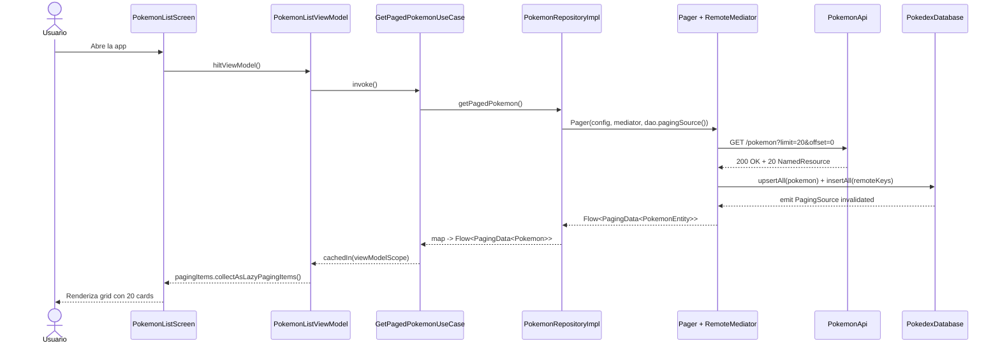
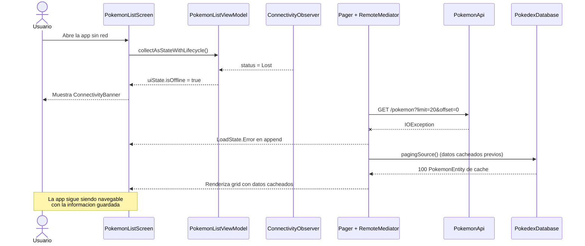
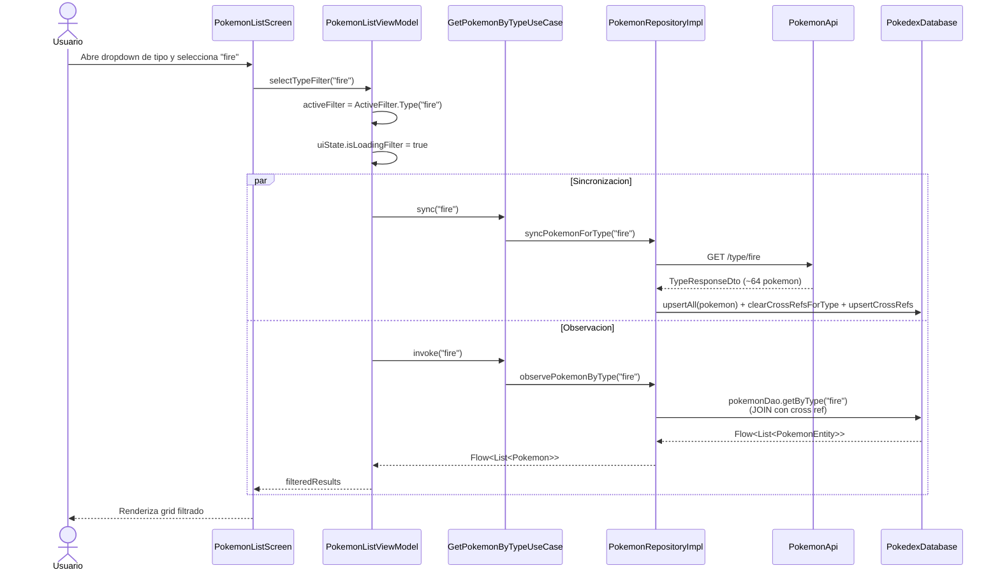
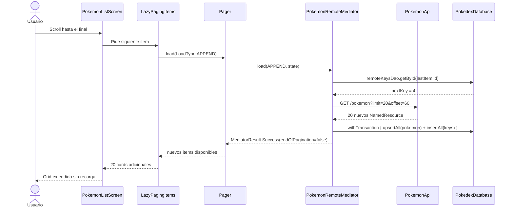
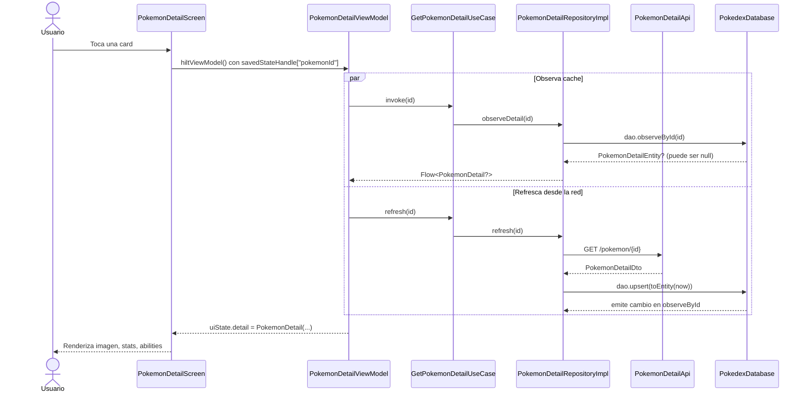
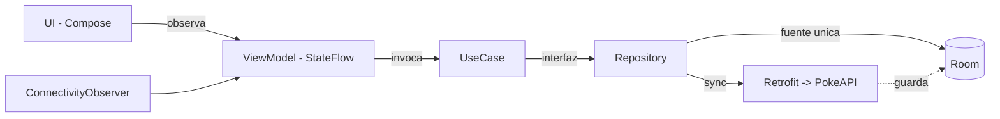

# 04 - Flujo de datos

Esta seccion muestra como viajan los datos para los cuatro escenarios principales: lista online, lista offline, filtro por tipo, paginacion con RemoteMediator.

## 1. Lista paginada (online)

## 2. Lista offline

## 3. Filtro por tipo

## 4. Paginacion con RemoteMediator (APPEND)

## 5. Detalle de un Pokemon

## Resumen visual

> Las flechas continuas representan dependencias directas. Las punteadas representan flujo de datos asincrono que cierra el ciclo (la API escribe a Room y la UI lo recibe via Flow).
