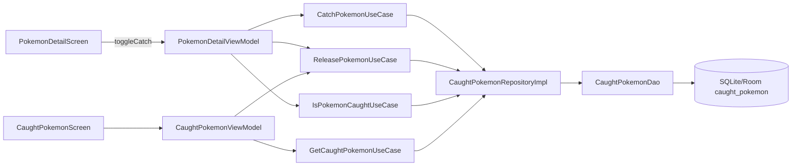
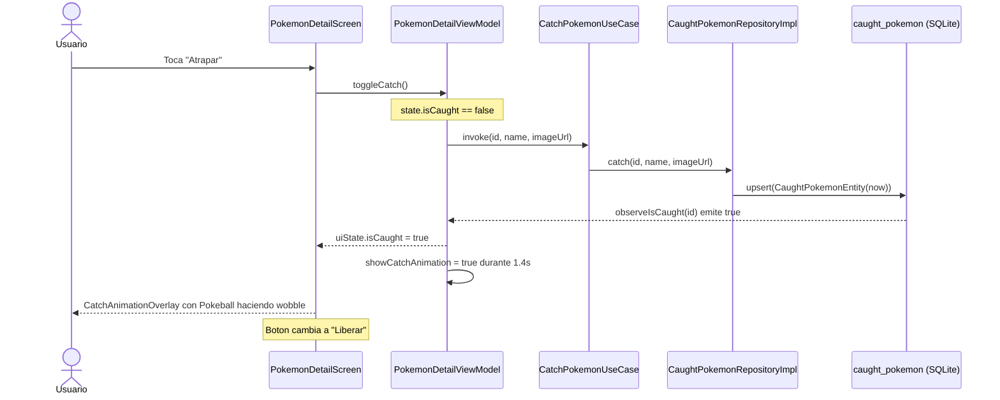
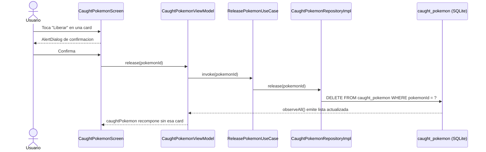

# 07 - Sistema de Captura

Esta es una funcionalidad propia (no proviene de PokeAPI): el usuario puede marcar un Pokemon como "atrapado" y verlo en una pantalla dedicada. La informacion se persiste en SQLite local, sobrevive al modo offline y al reinicio de la app.

## Componentes

## Flujo de captura

## Flujo de liberacion

## Detalles de implementacion

### Animacion de captura

`CatchAnimationOverlay` se monta encima del detalle cuando `showCatchAnimation = true`. Usa una `InfiniteTransition` con `animateFloat` que oscila entre -25 y +25 grados para hacer el wobble. El delay de 1.4s desbloquea el overlay y la animacion desaparece con `fadeOut + scaleOut`.

`CatchButton` tiene su propia `InfiniteTransition` que rota la Pokeball de 0 a 360 cada 600ms cuando `isAnimating`. Cuando termina, vuelve a 0.

### Sincronia entre pantallas

El detalle observa `IsPokemonCaughtUseCase(id)` y la lista observa `GetCaughtPokemonUseCase()`. Como ambos consumen el mismo Flow desde Room, una captura desde el detalle se refleja inmediatamente en "Mis atrapados" cuando el usuario navega ahi (y viceversa para liberar).

### Persistencia offline

Como `caught_pokemon` no tiene FK contra ninguna otra tabla, los atrapados sobreviven a:
- Invalidaciones del cache de la lista paginada (`RemoteMediator.LoadType.REFRESH`).
- Limpieza de los cross refs por filtro.
- Reinicio de la app sin red.

## Datos persistidos

Por cada captura se guarda:
- `pokemonId`: id nacional.
- `name` / `imageUrl`: snapshot al momento de atrapar (no requiere red para mostrarlo despues).
- `nickname`: campo opcional reservado para una iteracion futura (UI no expuesta aun).
- `caughtAt`: epoch ms para ordenar la lista de mas reciente a mas antiguo.
